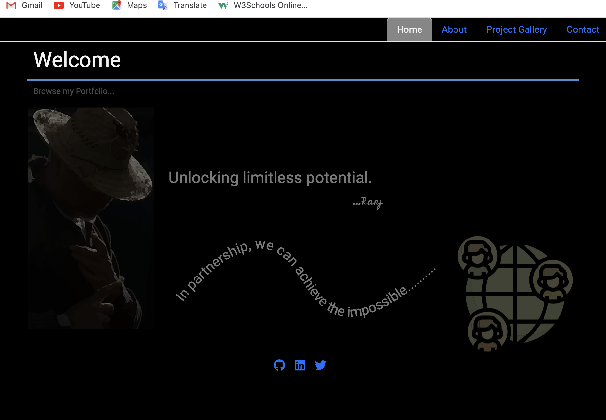
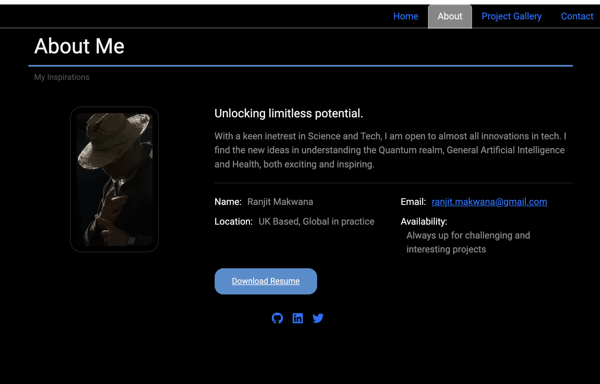
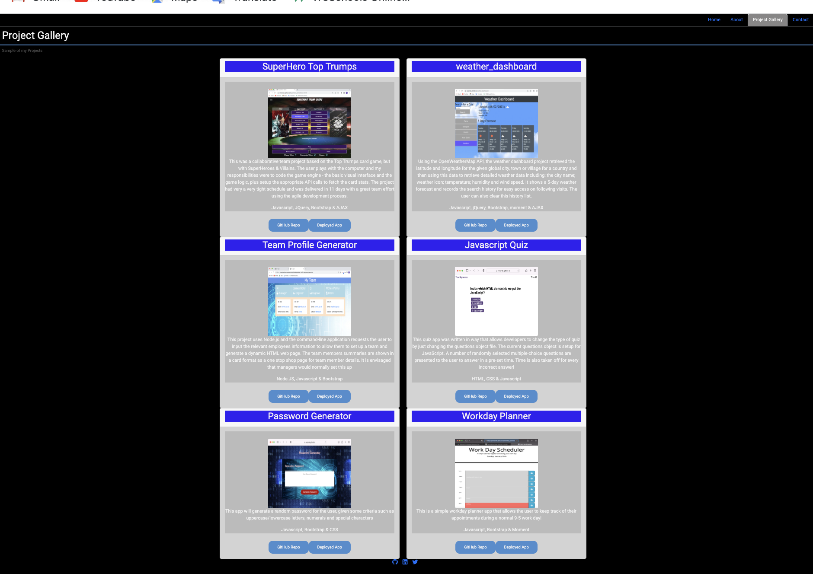
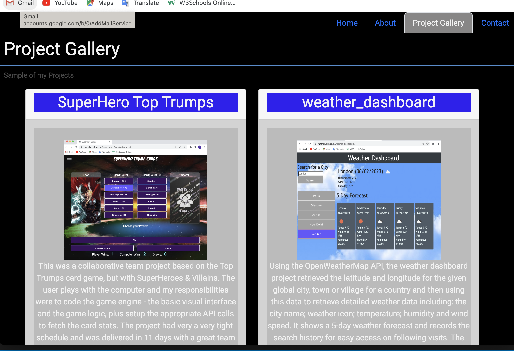
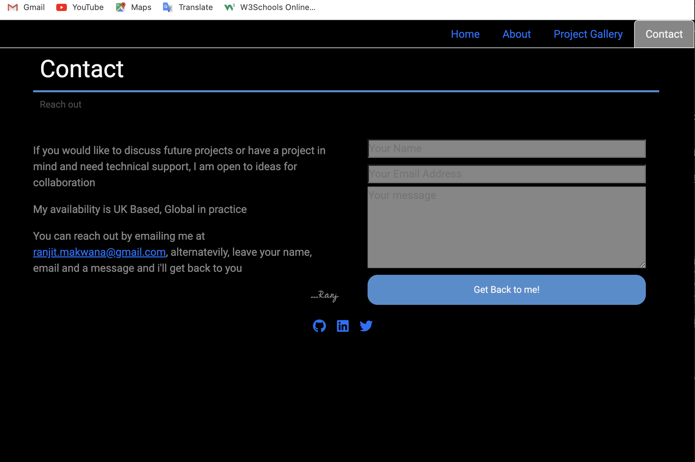
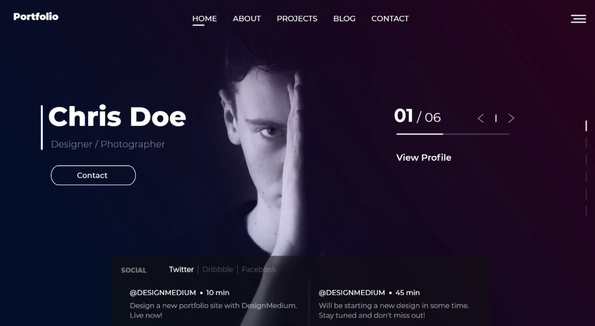

# ranj-portfolio-react

## Table of Contents
[Requirement](#requirement)

[Instructions](#instructions)

[Links](#links)

[Screenshots](#screenshots)

[Contributions](#contributions)

[Tests](#tests)

[Questions](#questions)

[License](#license)

## Requirement

An assignment as part of a Bootcamp course on frontend web development. For this challenge, utilising knowledge that's been accrued over the course of the bootcamp, this portfolio is the initial scaffolding using React and Framer-Motion. Note that this is work-in-progress... and is likely to substantially change in the future!

## Instructions

* The portfolio meets the following requirements

### Design

A "polished" and "professional" portfolio design using the following guidelines:

* Mobile-first design

* A non-bootstrap looking color palette for the site was chosen with a large enough font size and colours that are easy on the eye

### Base Requirements

* Technologies used:
  * [ ] React
  * [ ] Navigation with `React Router`, dynamic rendering, or another third part router
*  Portfolio **contains** the following information:
  * [ ] name
  * [ ] Links to:
    * [ ] GitHub Profile
    * [ ] LinkedIn Page
    * [ ] Email Address
    * [ ] Phone Number - (optional)
    * [ ] PDF version of your resume
      * Resume **contains** up-to-date projects and professional experience
    * [ ] A list of projects (Challenges or Projects). For each project, the following are included:
      * [ ] Project title
      * [ ] Link to the deployed version
      * [ ] Link to the GitHub repository
      * [ ] GIF or screenshot of the deployed application

### Required Components

* The portfolio renders these 7 components:
  1. [ ] App
  2. [ ] Header
  3. [ ] About
  4. [ ] Home
  5. [ ] Project Gallery
  6. [ ] Project
  7. [ ] Contact

### Required Component Content
* [ ] App:
  * [ ] Top level component and renders all necessary children components
* [ ] Header:
   * [ ] Rendered across the entire site
   * [ ] Contain's a Navbar
* [ ] Project Gallery:
  * [ ] Dynamically renders 6 instances of the Project component
    * [ ] Project data in stored in a JSON file and imported into project gallery
* [ ] Project:
   * [ ] A reusable component that ingests JSON data as a props and renders a single instance for each project.
   * [ ] Utilises router props to properly render the right project based on user selection
   * [ ] Renders the following info:
     * [ ] Project title
     * [ ] Link to the deployed version
     * [ ] Link to the GitHub repository
     * [ ] GIF or screenshot of the deployed application
     * [ ] A brief description of the project
     * [ ] The technologies used in developing the project
* [ ] Contact:
  * [ ] Contact information
  * [ ] A contact form for handling events and mailing it
* [ ] Home:
  * This should be a welcome landing page that contains:
     * [ ] Name
     * [ ] A Headshot of you
     * [ ] Your brand statement
     * [ ] CLear indication that this is a portfolio site

### Updated Social Media Presence
#### LinkedIn

* LinkedIn Profile

#### GitHub

* GitHub profile with pinned repositories featuring those same projects.

---

## Links

The files for this project can be found in this Github repo:
https://github.com/ranjmak/ranj-portfolio-react

The deployed portfolio can be found at these Github pages:
https://ranjmak.github.io/ranj-portfolio-react/

## Screenshots
The following image shows the landing/Home page:

---

The following image shows About page:

---

The following image shows the full Photo Gallery page:

---

The following image shows the full Photo Gallery page:

---

The following image shows the Contact page:

---

  ## Contributions
  If you would like to make a contribution to this project, please get in touch via email with your proposals

  ## Tests
  No particular tech was used for testing besides console logging in a piecemeal way!

  ## Acknowledgements
  There were a large number people and organisations whose ideas and work was used in helping to develop this portfolio. The initial inspiration for the look and feel came from . Many hours were spent pouring over others use of React with Framer-Motion, including a large number of YouTube videos! Certainly a labour of love.

  ## Questions
  Please feel free to reach out to me with any questions about this project at [ranjit.makwana@gmail.com](mailto:ranjit.makwana@gmail.com). You can also check out my Github profile: [ranjmak](https://github.com/ranjmak).

  ---

  ## License
  This project is licensed under the terms of the 

2023 Ranj

MIT License

Permission is hereby granted, free of charge, to any person obtaining a copy
of this software and associated documentation files (the "Software"), to deal
in the Software without restriction, including without limitation the rights
to use, copy, modify, merge, publish, distribute, sublicense, and/or sell
copies of the Software, and to permit persons to whom the Software is
furnished to do so, subject to the following conditions:

The above copyright notice and this permission notice shall be included in all
copies or substantial portions of the Software.

THE SOFTWARE IS PROVIDED "AS IS", WITHOUT WARRANTY OF ANY KIND, EXPRESS OR
IMPLIED, INCLUDING BUT NOT LIMITED TO THE WARRANTIES OF MERCHANTABILITY,
FITNESS FOR A PARTICULAR PURPOSE AND NONINFRINGEMENT. IN NO EVENT SHALL THE
AUTHORS OR COPYRIGHT HOLDERS BE LIABLE FOR ANY CLAIM, DAMAGES OR OTHER
LIABILITY, WHETHER IN AN ACTION OF CONTRACT, TORT OR OTHERWISE, ARISING FROM,
OUT OF OR IN CONNECTION WITH THE SOFTWARE OR THE USE OR OTHER DEALINGS IN THE
SOFTWARE.